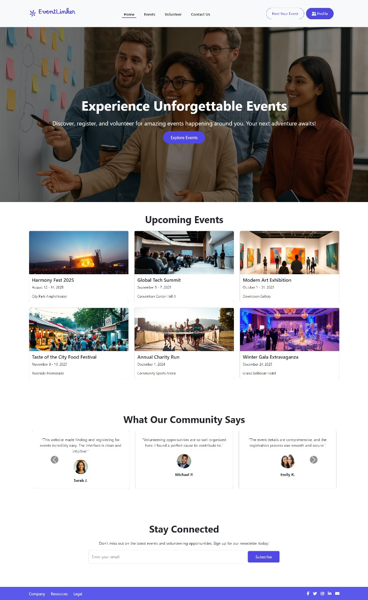
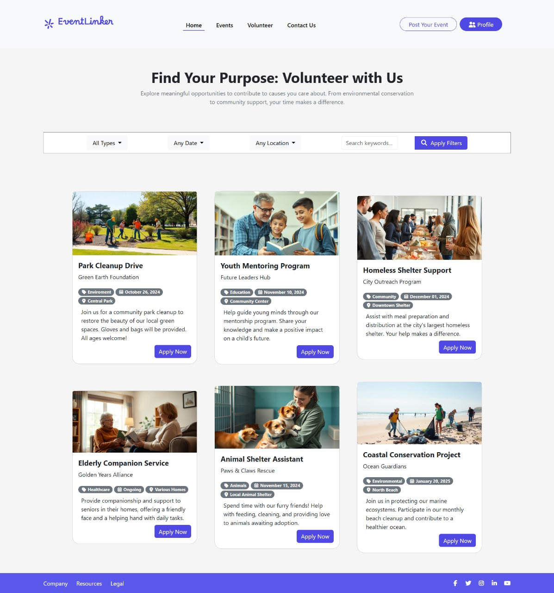
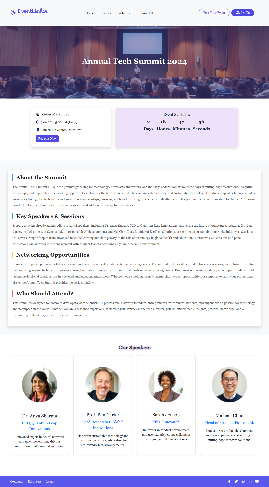
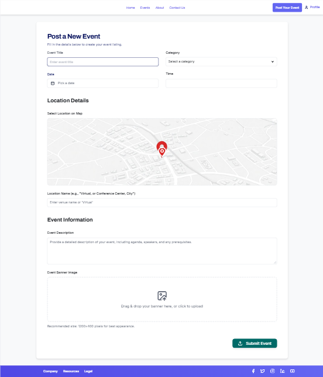
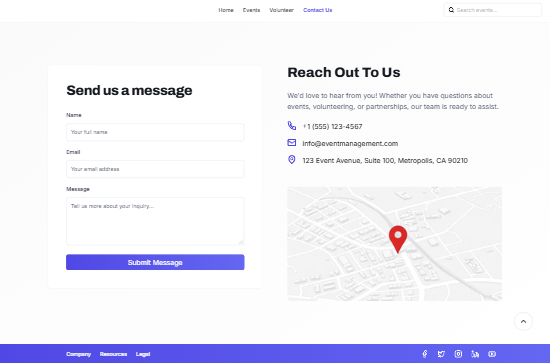
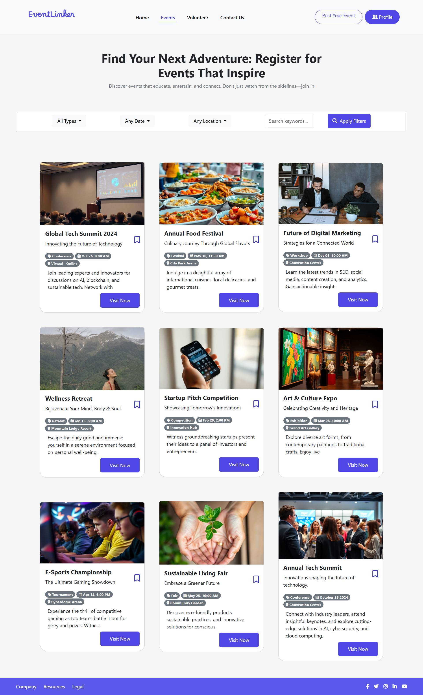

# 📌 EventLinker

EventLinker is a youth & cultural events platform that allows users to discover, join, and share events.  
It also supports volunteering opportunities, posting new events, and contacting the organizers directly.

---

## Table of Contents

- [EventLinker](#eventlinker)
  - [Table of Contents](#table-of-contents)
  - [Key Features](#key-features)
    - [Feature 1: Homepage](#feature-1-homepage)
      - [Feature 1 Live Design Preview](#feature-1-live-design-preview)
    - [Feature 2: Volunteering Page](#feature-2-Volunteering-page)
      - [Feature 2 Live Design Preview](#feature-2-live-design-preview)
    - [Feature 3: Event Details](#feature-3-event-details)
      - [Feature 3 Live Design Preview](#feature-3-live-design-preview)
    - [Feature 4: Post Event](#feature-4-post-event)
      - [Feature 4 Live Design Preview](#feature-4-live-design-preview)
    - [Feature 5: Contact Us](#feature-5-contact-us)
      - [Feature 5 Live Design Preview](#feature-5-live-design-preview)
    - [Feature 6: Events Page](#feature-6-events-page)  
      - [Feature 6 Live Design Preview](#feature-6-live-design-preview)  
    - [Feature 7: Profile Page](#feature-7-profile-page)  
      - [Feature 7 Live Design Preview](#feature-7-live-design-preview)  
  - [System Requirements](#system-requirements)
  - [For Registered Users](#for-registered-users)

---

## Key Features

### Feature 1: Homepage

#### Feature 1 Live Design Preview
  
*Fig 1.1 - Homepage showcasing featured events and navigation*

---

**Description:**  
- Main landing page of the Website.  
- Displays highlighted events and provides easy navigation across the platform.  
- Entry point for discovering activities.

**Key Functionalities:**
- View featured events
- Navigate to volunteering, event details, and other pages
- Search for events

---

### Feature 2: Volunteering Page

#### Feature 2 Live Design Preview
  
*Fig 2.1 - Volunteering opportunities listing*

---

**Description:**  
- Dedicated page for volunteering opportunities.  
- Users can explore activities to participate in and contribute to the community.

**Key Functionalities:**
- Browse volunteering events
- View details about each opportunity
- Apply or register to volunteer

---

### Feature 3: Event Details

#### Feature 3 Live Design Preview
  
*Fig 3.1 - Full event details page with description and registration options*

---

**Description:**  
- Provides complete details of a selected event.  
- Helps users understand the purpose, date, time, and location of the event.

**Key Functionalities:**
- View event description, date, and location
- Option to register
- Show the Speakers of the Event

---

### Feature 4: Post Event

#### Feature 4 Live Design Preview
  
*Fig 4.1 - Add new event post form*

---

**Description:**  
- Allows users or admins to add new event posts.  
- Keeps the platform updated with new activities.

**Key Functionalities:**
- Input form for event details (title, description, category, date)
- Upload images or flyers
- Publish event to homepage

---

### Feature 5: Contact Us

#### Feature 5 Live Design Preview
  
*Fig 5.1 - Contact form for inquiries and support*

---

**Description:**  
- A simple page to let users contact the team for support or questions.  
- Includes form submission and team contact info.

**Key Functionalities:**
- Contact form (Name, Email, Message)
- Social media links
- Email/phone support details

---
### Feature 6: Events Page

#### Feature 6 Live Design Preview
  
*Fig 6.1 - Events listing page with filters and categories*

---

**Description:**  
- A dedicated page for browsing all events on the platform.
- Users can search and filter events based on categories, dates, or locations.

**Key Functionalities:**
- Display events in a clean, card-based layout.
- Filter by event type (conference, workshop, exhibition, etc.).
- Filter by date and location.
- Keyword-based search bar.
- Save events as favorites (bookmark).
- “Visit Now” button to navigate to event details.

---
### Feature 7: Profile Page

#### Feature 7 Live Design Preview
  
*Fig 7.1 - User profile page with personal info and event tracking*

---

**Description:**  
- A personal page for each registered user that shows their basic details, activities on the platform, and the events they have registered for.

**Key Functionalities:**
- Display profile information (name, email, photo, phone number).
- Sidebar navigation (Dashboard – My Events – Registered Events – Volunteering – Notifications – Settings).
- Manage user’s own events (edit/delete).
- Cancel event registrations.
- Track volunteering opportunities (Active – Pending – Withdrawn).
- Edit profile details (Edit Profile).
- Logout from account.

---

## System Requirements

- Modern web browser (Chrome, Firefox, Edge, Safari)
- Stable internet connection

---
# For Registered Users

## By creating an account, users can:

- Post new events and manage their own content.

- Register as volunteers and track their participation.

- Save favorite events for later.

- Access their event history and manage registrations.